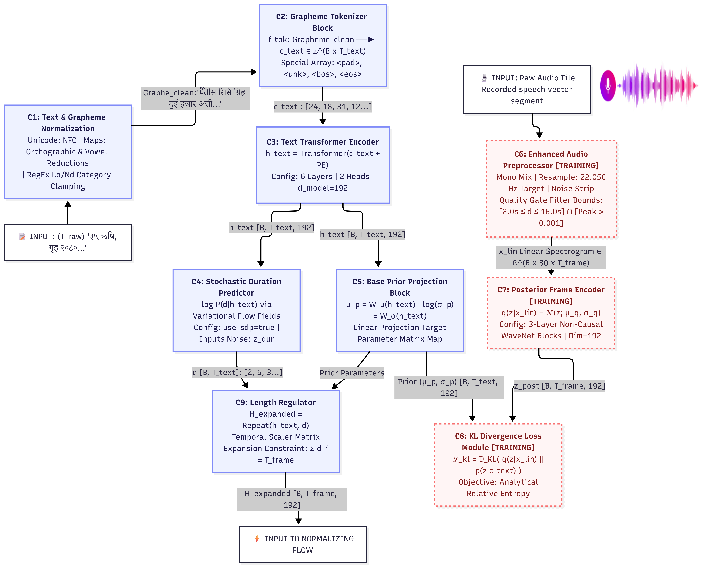
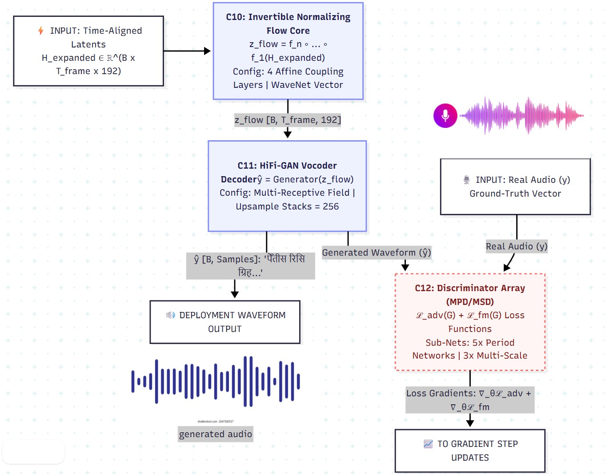
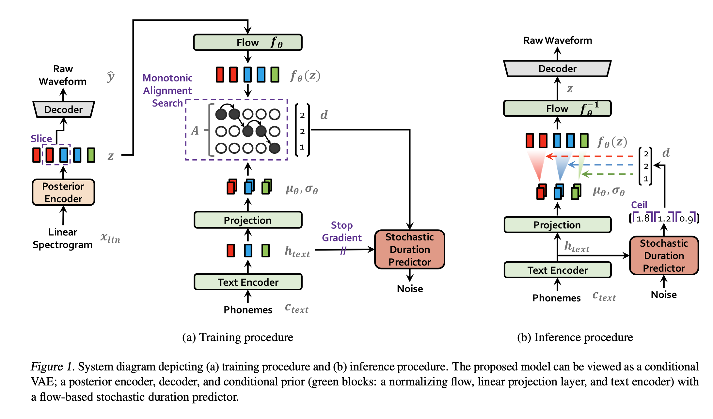

# Nepali News-Style Text-to-Speech (TTS)

This repository contains the official codebase for the **Nepali News-Style Text-to-Speech (TTS)** project. Built on top of the **VITS2** architecture, this project is designed to generate highly natural, broadcast-quality Nepali speech directly from raw Devanagari text. 

By eliminating complex Grapheme-to-Phoneme (G2P) pipelines and adopting a robust text-normalization strategy, the system achieves excellent expressive speech synthesis that closely mimics professional news anchors.

## System Architecture & Data Flow

The project follows a comprehensive pipeline from raw broadcast data collection to a fully interactive User Interface.




## Core VITS2 Architecture

The synthesis engine is driven by a state-of-the-art end-to-end neural network that directly generates raw audio waveforms from textual input without requiring separate vocoders.



## Key Features

- **VITS2 Architecture:** Utilizes adversarial learning for duration prediction and transformer blocks within normalizing flows for superior speech naturalness.
- **Robust Text Normalizer:** Processes Devanagari directly. Features include Unicode normalization (NFC), number verbalization, grapheme mapping (simplifying complex consonants while preserving critical conjuncts like `ज्ञ` and `क्ष`), and post-position spacing adjustments.
- **Zero G2P Dependency:** The model implicitly learns phonetic patterns directly from normalized text, bypassing the error-prone Schwa-deletion algorithms in traditional Nepali NLP.
- **Balanced Audio Processing:** Synthesizes audio at a 22,050 Hz sampling rate, preserving natural micro-variations that overly aggressive noise-reduction typically destroys.
- **REST API & Web Interface:** Includes a fully-featured Flask API (`app.py`) designed to interface with a Next.js frontend, enabling real-time script processing, smart text chunking for long articles, and seamless WAV generation.

## Repository Structure

```
.
├── app.py                  # Flask backend for text normalization and VITS inference
├── configs/                # JSON configurations for training and inference
├── data_preparation/       # Scripts used to build and clean the dataset
├── logs/                   # Directory containing trained VITS2 model checkpoints
├── models.py               # VITS2 core architecture
├── text/                   # Tokenization and symbol mapping for the model
├── static/                 # Next.js frontend build files
└── requirements.txt        # Python dependencies
```

## Quick Start (Inference)

### 1. Install Dependencies
Make sure you are using Python 3.10+ and install the requirements:
```bash
pip install -r requirements.txt
```

*(Note: PyTorch installation might vary depending on your CUDA setup. Visit [pytorch.org](https://pytorch.org/) for specific installation commands.)*

### 2. Setup the Monotonic Alignment Search
VITS requires building the Cython MAS extension:
```bash
cd monotonic_align
python setup.py build_ext --inplace
cd ..
```

### 3. Run the API Server
Ensure your trained checkpoint (e.g., `G_*.pth`) is in the `logs/` directory, and the configuration file is in `configs/`.

Start the Flask application:
```bash
python app.py
```
The server will start on `http://localhost:5000`. You can test the endpoints or use the built-in UI by navigating to the root URL.

## API Endpoints

- `GET /api/status` - Returns model loading status.
- `GET /api/speakers` - Returns available voice profiles.
- `POST /api/normalize` - Send `{ "text": "Raw Text" }` to receive the normalized Devanagari string.
- `POST /api/synthesize` - Send text and parameters to generate speech. Returns a `WAV` file.

## Data Preparation

If you are interested in reproducing the training dataset from raw Sagarmatha TV recordings, check the `data_preparation/` directory. It contains all the step-by-step scripts used to filter, trim, and normalize the data prior to training.

## Authors

Developed by Pulchowk Campus (078 BEI) Students:
- Sandip Acharya
- Sahadev Chaulagain
- Samyam Giri
*Supervised by Assoc. Prof. Dr. Dibakar Raj Pant*
